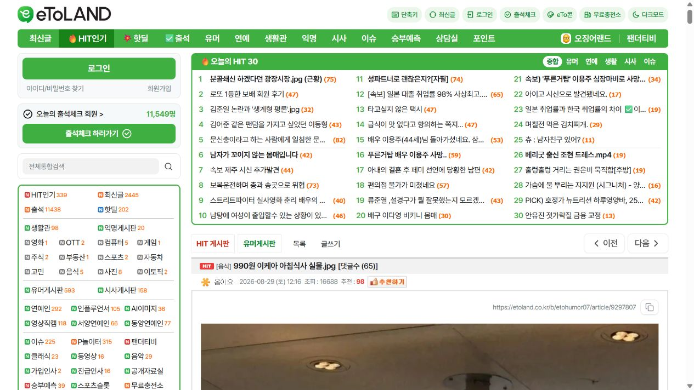

# 990원 아침식사가 화제인 이유, 가격 다음에 볼 아침 식단의 조건

최근 커뮤니티에서 `990원 이케아 아침식사 실물`이라는 게시물이 관심을 모았습니다. 1,000원도 안 되는 가격으로 아침을 해결할 수 있다는 점이 눈길을 끌지만, 매일 먹을 아침이라면 가격과 양 외에 단백질, 식이섬유, 당류의 구성도 함께 볼 필요가 있습니다.

## 싸고 간단한 아침이 오래가기 어려운 이유

빵이나 시리얼은 편리하지만 한 가지 식품으로만 끼니를 반복하면 포만감이 빨리 사라질 수 있습니다. 특히 혼자 생활하면 채소를 손질하고 단백질 식품까지 따로 준비하는 일이 부담스럽습니다. 완벽한 식단보다 중요한 것은 시간이 없을 때도 반복할 수 있는 최소한의 구성입니다.

## 먼저 확인할 세 가지

첫째는 단백질입니다. 탄수화물 위주의 아침보다 단백질을 함께 챙기는 편이 오전 식사 구성을 안정적으로 만들기 쉽습니다.

둘째는 식이섬유입니다. 과일과 채소를 충분히 먹지 못한다면 한 끼의 식이섬유 함량을 확인해보세요.

셋째는 지속 가능성입니다. 아무리 좋은 식사도 준비가 복잡하면 며칠 뒤 포기하기 쉽습니다. 냉장고 상황이나 요리 실력에 영향을 덜 받는 방법을 마련해두는 것이 현실적입니다.

## 준비할 시간이 없는 날의 선택

프룻킹은 물 150ml를 넣고 흔들어 먹는 파우치형 제품입니다. 한 포에 단백질 18g이 들어 있고 케일블렌드는 식이섬유 12.6g, 베리루트는 11.6g을 담고 있습니다. 27종 과일·채소 혼합 원료와 프랑스산 요구르트 유래 유산균 9억 CFU도 함께 들어 있습니다.

케일블렌드는 케일·사과·파인애플의 상큼한 맛이고, 베리루트는 비트·블루베리·바나나의 진한 베리 계열입니다. 아침 식사는 무조건 비싸거나 복잡할 필요가 없습니다. 가격 다음에는 무엇이 들어 있는지, 내일도 같은 방식으로 준비할 수 있는지를 확인해보세요.

## 이미지·영상 자료

- [커뮤니티 원문](https://etoland.co.kr/hit/etohumor07/view/990%EC%9B%90-%EC%9D%B4%EC%BC%80%EC%95%84-%EC%95%84%EC%B9%A8%EC%8B%9D%EC%82%AC-%EC%8B%A4%EB%AC%BC-jpg-9297807)
- [IKEA 공식 관련 이미지](https://www.ikea.com/kr/ko/stores/goyang/swedish-restaurant-pubc1a24d40/)
- 관련 공식 영상은 확인되지 않아 `물 150ml에 흔드는 15초 제품 영상`을 제작 권장

## 제품 구매

- [프룻킹 상품 1](https://smartstore.naver.com/fruit-king/products/13681570096)
- [프룻킹 상품 2](https://smartstore.naver.com/fruit-king/products/13681581067)
