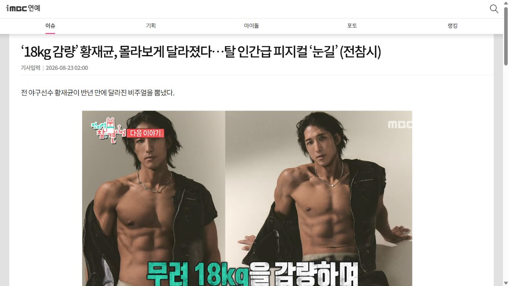

# 황재균 18kg 감량이 화제, 체중보다 근육을 함께 봐야 하는 이유

MBC `전지적 참견 시점`에서 황재균이 은퇴식을 준비하며 18kg을 감량한 모습이 공개돼 화제가 됐습니다. 방송 기사에 따르면 그는 바디프로필 촬영을 목표로 6개월 동안 식단을 관리했고 체지방률 3.9%를 기록했습니다.

18kg이라는 숫자는 강한 인상을 줍니다. 하지만 일반인이 결과만 따라 하기보다 먼저 살펴봐야 할 것은 몸무게가 줄어드는 동안 근육과 일상 체력을 어떻게 유지할 것인가입니다.

## 체중계 숫자만 보면 놓치기 쉬운 것

체중은 지방뿐 아니라 근육과 수분 상태에 따라서도 달라집니다. 먹는 양을 크게 줄이면 숫자는 빠르게 내려갈 수 있지만 자신이 원한 형태의 변화인지 구분하기 어렵습니다.

특히 중년 이후에는 잘 걷고 계단을 오르며 일상생활을 유지하는 몸이 중요합니다. SBS `랭킹송: 건강한가요`에서 노년기 병적 골절을 다룬 내용도 체중뿐 아니라 근육과 뼈를 함께 관리해야 한다는 문제와 연결됩니다.

## 감량 식단에서 확인할 세 가지

첫째, 하루 식사에서 단백질원이 빠지지 않았는지 확인합니다. 둘째, 채소와 식이섬유를 함께 챙깁니다. 셋째, 극단적인 기간을 정하기보다 일상으로 돌아온 뒤에도 유지할 수 있는 방법을 선택합니다.

방송에서도 오랜 식단 관리가 끝난 뒤 억눌렀던 식욕이 한꺼번에 터지는 모습이 예고됐습니다. 강한 제한보다 반복 가능한 루틴이 중요한 이유입니다.

## 바쁜 날에도 단백질과 식이섬유 챙기기

프룻킹은 한 포에 단백질 18g을 담고 있습니다. 케일블렌드는 식이섬유 12.6g과 당류 3.7g, 베리루트는 식이섬유 11.6g과 당류 1.8g입니다.

물 150ml를 넣어 흔드는 방식이라 출근 전이나 운동을 마친 뒤 복잡한 조리 없이 준비할 수 있습니다. 감량 목표를 단순히 몇 kg로만 정하지 말고 식사의 구성, 근육을 사용하는 활동, 감량이 끝난 뒤에도 유지할 생활까지 함께 보세요.

## 이미지·영상 자료

- [MBC 18kg 감량 기사](https://enews.imbc.com/M/Detail/515587)
- [전지적 참견 시점 공식 페이지](https://program.imbc.com/omniscient)
- [SBS 랭킹송 관련 회차](https://programs.sbs.co.kr/programTemplate/amp/vod/rankingsongs/22000634414)

## 제품 구매

- [프룻킹 상품 1](https://smartstore.naver.com/fruit-king/products/13681570096)
- [프룻킹 상품 2](https://smartstore.naver.com/fruit-king/products/13681581067)
